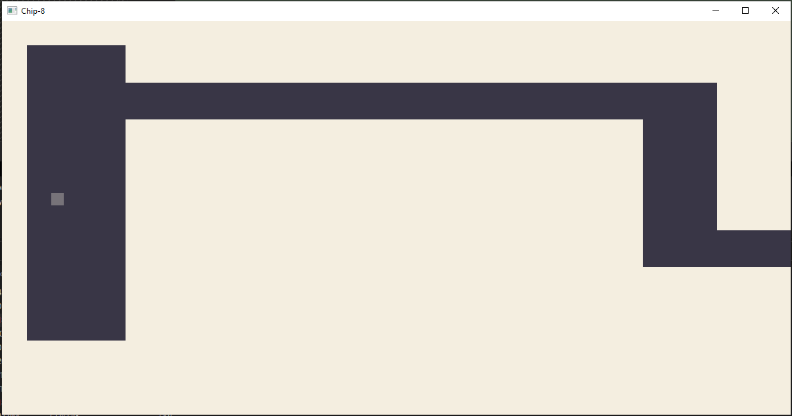

# RUSTY-CHIP8
## ABOUT 
Rust-Chip-8 is a Chip-8 emulator written in Rust. It can run commercial games and passes all the tests in the [Chip-8 Test Suite](https://github.com/Timendus/chip8-test-suite).  
Graphics are rendered to the screen using [OpenGL](https://www.opengl.org/), while [GLFW](https://www.glfw.org/) is used for handling user input and window management.

## USAGE
Roms can be loaded by dragging and dropping them on the emulator window, or by passing their filepath as an argument when running (e.g.: `./rusty-chip8 /my/rom.ch8`).

## DEPENDENCIES
This project uses the default Rust toolset, and needs `rustc` and `cargo` to be built.

## BUILD
The project can be built by running `cargo build`, that will download the dependencies and build the project.

## SREENSHOTS
Below are some screenshots of games running on the emulator.  

### Tetris
  

### Space Invaders
  

### Merlin
  

### Cave
